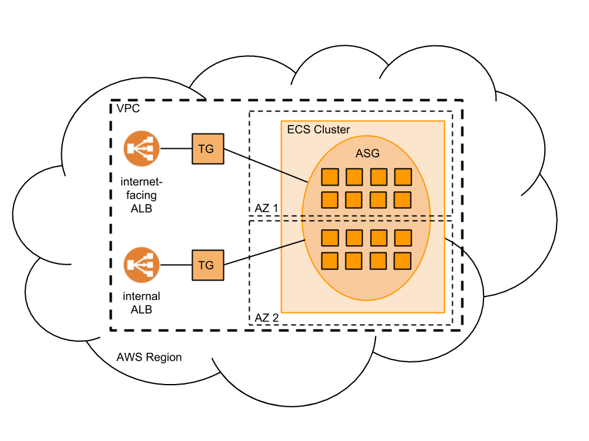
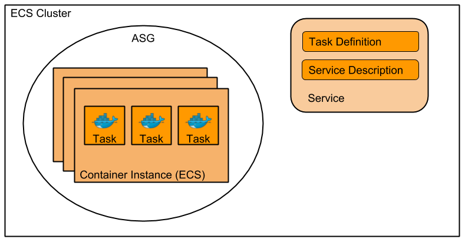

# Cloudcrane (alpha)
Easy deployment of microservices with AWS CloudFormation and Elastic Container Service (ECS).

## Installation
Clone this repository and install Cloudcrane on your machine using the following command

        $ sudo python3 setup.py install

## ECS cluster management with Cloudcrane

1. Create SSH key pair for your ECS cluster
 
        $ aws ec2 create-key-pair --key-name ecs-ssh
 
2. The following command will create an ECS cluster as shown in the picture above in your AWS account

        $ cloudcrane cluster --ami='<AMI_ID>' create
        
### List ECS clusters
In order to see the currently running ECS clusters in your account run

        $ cloudcrane cluster list

### Delete ECS cluster

        $ cloudcrane cluster delete

### Service deployment with Cloudcrane

1. Deploy Docker image of your application to AWS ECR
2. Create a Cloudcrane configuration file for your application (see example.yaml)
3. Deploy your application to your AWS account

        $ cloudcrane service --application=my-app --version=1 --parameters=example.yaml deploy
        
## Delete application

        $ cloudcrane service --application=my-app --version=1 delete        
        
## Connect to your Docker container
For connecting via SSH, add port 22 to security group first, then:

        $ ssh -i "my-app-ssh.pem" ec2-user@EC2_INSTANCE_URL
        $ docker exec -it CONTAINER_ID bash
